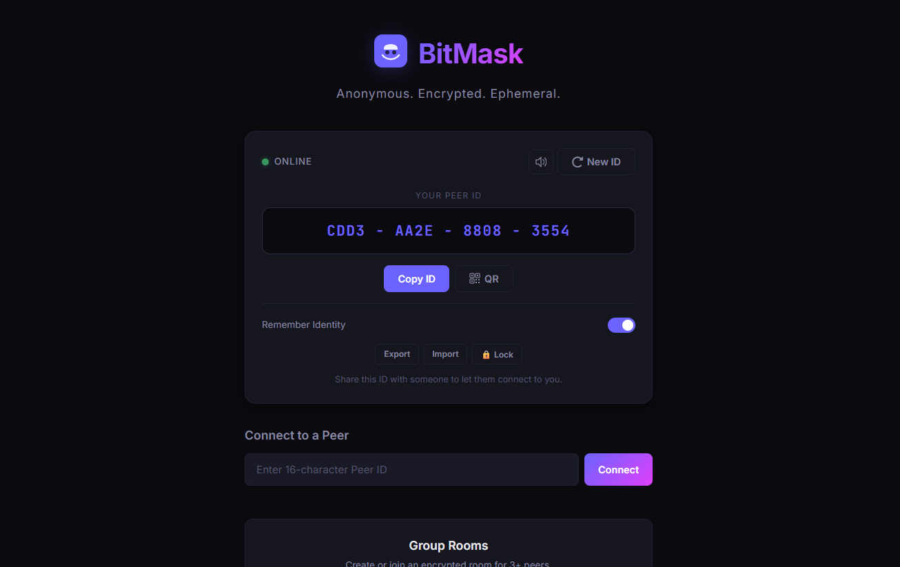
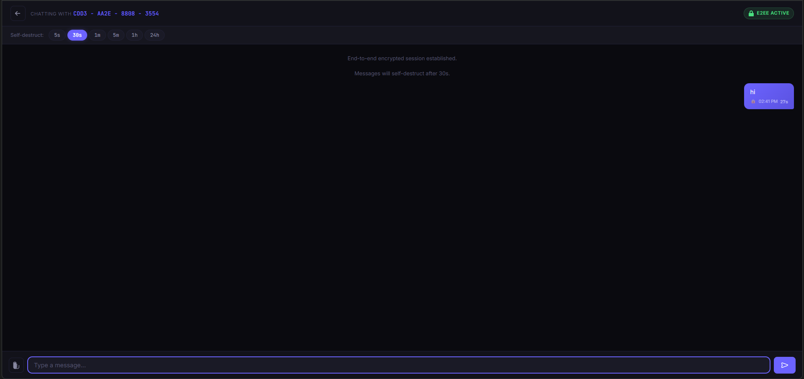

<p align="center">
  
  
  
  
</p>

<h1 align="center">🎭 BitMask</h1>
<p align="center"><strong>Anonymous. Encrypted. Ephemeral.</strong></p>
<p align="center">A zero-knowledge, end-to-end encrypted chat platform with self-destructing messages.<br/>No accounts. No logs. No trace.</p>

---

## Features

| Feature | Description |
|---------|-------------|
| **🔒 End-to-End Encryption** | ECDH P-256 key exchange + AES-256-GCM. The server relays ciphertext it cannot decrypt. |
| **💨 Self-Destructing Messages** | Every message has a TTL (5s → 24h). Countdown is visible. At zero, it's gone forever. |
| **📂 Encrypted File Sharing** | Send images and files up to 5 MB — all encrypted before leaving your device. |
| **🆔 Persistent Identity** | Optionally "Remember" your Peer ID across sessions with a single toggle. |
| **🔐 Passphrase Lock** | Lock your identity with a passphrase. It's encrypted locally — we never see it. |
| **📤 Export / Import** | Download your identity as an encrypted `.bitmask` file. Restore it on any device. |
| **📱 QR Code** | Generate a QR code of your Peer ID for easy sharing. Fully offline, zero dependencies. |
| **👥 Group Rooms** | Create encrypted rooms for 3+ peers. Share a 6-char code and everyone's in — up to 20 members. |
| **🔔 Sound Notifications** | Web Audio API synthesized sounds for messages, connections, and self-destruct events. |
| **👻 Zero Knowledge** | No accounts, no databases, no cookies, no analytics. Server state lives in RAM only. |
| **⚡ Real-Time** | WebSocket-powered via Socket.io with typing indicators and instant delivery. |

## Screenshots





## Architecture

```
┌──────────────────────────────────────────────────────────────────┐
│  1:1 Mode                Group Mode (3-20 peers)                │
│                                                                  │
│  Browser A  ◄─────►  Browser B    Browser A ◄──► Browser B      │
│  (ECDH shared key)                    ▲  ▲                      │
│                                       │  └──── Browser C        │
│                                       └─────── Browser D        │
│                                  (AES-256 group key)            │
│                                                                  │
│  Both modes: AES-256-GCM encryption, server sees only blobs     │
│                                                                  │
│                    ┌─────────────────────┐                       │
│                    │   Node.js Server    │                       │
│                    │   (Relay only)      │                       │
│                    │   Zero knowledge    │                       │
│                    │   RAM-only state    │                       │
│                    └─────────────────────┘                       │
└──────────────────────────────────────────────────────────────────┘
```

The server **never** sees plaintext. It relays encrypted blobs between peers and forgets everything on restart.

## Tech Stack

| Layer | Technology |
|-------|-----------|
| **Server** | Node.js, Express, Socket.io |
| **Encryption** | Web Crypto API (ECDH P-256, AES-256-GCM, PBKDF2) |
| **Security** | Helmet, express-rate-limit, CSP headers |
| **Frontend** | Vanilla JS, CSS custom properties, Web Audio API |
| **QR Generator** | Custom implementation — Reed-Solomon, GF(256), no CDN |

## Quick Start

### Prerequisites

- [Node.js](https://nodejs.org/) 18 or higher
- npm (comes with Node.js)

### Installation

```bash
# Clone the repository
git clone https://github.com/Esca-Byte/BitMask.git
cd BitMask

# Install dependencies
npm install

# Create environment file (optional)
cp .env.example .env
```

### Run

```bash
# Development (auto-restart on file changes)
npm run dev

# Production
npm start
```

The server starts at **http://localhost:3000** by default.

### Environment Variables

Create a `.env` file in the root directory:

```env
PORT=3000
RATE_LIMIT_WINDOW_MS=900000
RATE_LIMIT_MAX_REQUESTS=100
```

All variables are optional — sensible defaults are built in.

## Project Structure

```
BitMask/
├── server.js                  # Express + Socket.io server
├── package.json
├── .env                       # Environment config (gitignored)
├── .gitignore
└── public/
    ├── index.html             # Single-page app (landing + chat + modals)
    ├── privacy.html           # Privacy Policy
    ├── terms.html             # Terms of Service
    ├── css/
    │   ├── style.css          # Dark theme — all app styles
    │   └── legal.css          # Privacy & Terms page styles
    └── js/
        ├── app.js             # Main controller — UI, chat, file sharing
        ├── crypto.js          # E2EE — ECDH key exchange, AES-GCM encrypt/decrypt
        ├── socket.js          # Socket.io client wrapper
        ├── identity.js        # Persistence — Remember Me, Export/Import, Passphrase Lock
        ├── notifications.js   # Sound notifications via Web Audio API
        └── qrcode.js          # QR code generator (self-contained, no deps)
```

## How It Works

### 1. Identity
When you open BitMask, a random **16-character Peer ID** and an **ECDH key pair** are generated in your browser. By default, they live in `sessionStorage` (erased on tab close). Enable "Remember Identity" to persist them in `localStorage`.

### 2. Key Exchange

**1:1 mode:** When two peers connect, they exchange public keys through the server. Each browser independently derives the same **shared secret** using ECDH — the server never learns it.

**Group mode:** The host generates a random **AES-256 group key**. When a new peer joins, the host performs an ECDH exchange with the joiner and wraps the group key using the pairwise shared secret. The server never sees the group key.

### 3. Encryption
Every message and file is encrypted client-side with **AES-256-GCM** — using the pairwise ECDH key (1:1) or the shared group key (groups) — with a fresh 96-bit IV per message. The server only sees opaque ciphertext.

### 4. Self-Destruct
Each message carries a TTL chosen by the sender. All recipients run a countdown timer. At zero, the message DOM element is destroyed, and the plaintext is garbage-collected. The server purges any queued copy on TTL expiry or read-acknowledgment.

### 5. File Sharing
Files (up to 5 MB) are read as `ArrayBuffer`, encrypted with AES-256-GCM, and sent via Socket.io. Recipients decrypt and render them — images get inline previews, other files get a download button. Works in both 1:1 and group mode.

### 6. Group Rooms
Create a room → get a **6-character room code** → share it → others join. The host generates and distributes an AES-256 group key encrypted per-member via ECDH. Up to **20 members** per room. Automatic host transfer if the host leaves. Sender labels, multi-peer typing indicators, and member list are all included.

## Security Design

| Property | Implementation |
|----------|---------------|
| **Confidentiality** | AES-256-GCM with ECDH-derived key (1:1) or host-generated group key (rooms) |
| **Integrity** | GCM authentication tag on every message and file |
| **Forward Secrecy** | New ECDH key pair per identity (new keys on "New ID") |
| **Group Key Distribution** | Host wraps AES-256 group key per-member via ECDH pairwise channel |
| **Zero Server Knowledge** | Server relays ciphertext only, RAM-only state |
| **No Persistence** | No database, no disk writes, no logs, no backups |
| **Rate Limiting** | Per-IP HTTP limits + per-connection socket event limits |
| **CSP Headers** | Strict Content-Security-Policy via Helmet |
| **Identity Protection** | PBKDF2 (310K iterations) + AES-256-GCM for passphrase lock |

### What We Cannot Prevent
- Recipients screenshotting before self-destruct
- Compromised browsers or devices
- ISP-level connection metadata logging
- Traffic correlation attacks

For stronger anonymity, use BitMask over **Tor** or a trusted **VPN**.

## API

### Health Check

```
GET /api/health
```

Returns `{ status: "ok", uptime: <seconds> }`.

### Socket Events

| Event | Direction | Description |
|-------|-----------|-------------|
| `register` | Client → Server | Register Peer ID + public key |
| `connect-to-peer` | Client → Server | Initiate 1:1 connection to a Peer ID |
| `create-room` | Client → Server | Create a group room (returns 6-char code) |
| `join-room` | Client → Server | Join a group room by code |
| `distribute-key` | Client → Server | Host sends encrypted group key to a peer |
| `send-message` | Client → Server | Send encrypted message (1:1 or group) |
| `send-file` | Client → Server | Send encrypted file (max 5 MB) |
| `typing` | Client → Server | Typing indicator toggle |
| `leave-room` | Client → Server | Leave current chat room |
| `peer-connected` | Server → Client | Incoming 1:1 peer connection |
| `peer-disconnected` | Server → Client | 1:1 peer left the room |
| `peer-joined` | Server → Client | New member joined a group room |
| `peer-left` | Server → Client | Member left a group room |
| `group-key` | Server → Client | Host-encrypted group key delivered |
| `host-changed` | Server → Client | Group host transferred to new member |
| `message` | Server → Client | Incoming encrypted message |
| `file` | Server → Client | Incoming encrypted file |
| `typing` | Server → Client | Peer typing status |

## Deployment

### Deploy to Railway / Render / Fly.io

BitMask is a single `server.js` file with no build step. Deploy it like any Node.js app:

```bash
# Set the start command
npm start

# Set PORT if the platform requires it
PORT=8080
```

### Docker

```dockerfile
FROM node:18-alpine
WORKDIR /app
COPY package*.json ./
RUN npm ci --production
COPY . .
EXPOSE 3000
CMD ["node", "server.js"]
```

```bash
docker build -t bitmask .
docker run -p 3000:3000 bitmask
```

## Contributing

1. Fork the repository
2. Create a feature branch: `git checkout -b feature/my-feature`
3. Commit your changes: `git commit -m 'Add my feature'`
4. Push to the branch: `git push origin feature/my-feature`
5. Open a Pull Request

Please make sure your code follows the existing style and doesn't introduce any external dependencies on the client side.

## License

This project is licensed under the **MIT License** — see the [LICENSE](LICENSE) file for details.

---

<p align="center">
  <strong>🎭 BitMask</strong> — Because privacy is not a privilege. It's a right.
</p>
#

